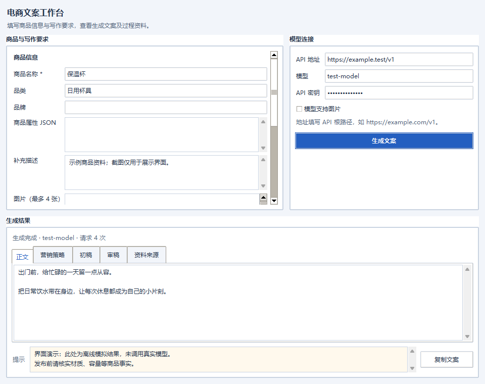
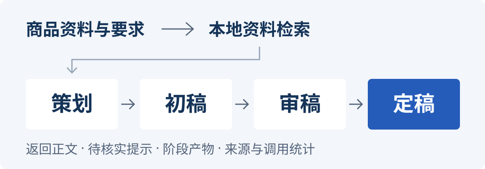

# 电商文案 Agent

**从商品资料到可审查的文案。**

输入商品信息、写作要求和可选图片，取得正文、营销策略、初稿、审稿意见与资料来源。可嵌入 Python 程序，也可用附带的 Tkinter 桌面工具试用；模型服务由你配置。

**Python 3.11+** · **同步 / 异步调用** · **OpenAI Chat Completions 兼容接口**

[快速开始](#快速开始) · [生成流程](#从资料到定稿) · [Python 集成](#嵌入-python-程序) · [进阶配置](#进阶配置) · [验证与边界](#验证与使用边界)



*实际桌面界面，截图结果为离线模拟，仅展示交互。正文可直接复制，阶段产物与待核实提示可分别查看；截图不证明真实模型的文案效果。*

## 快速开始

需要 **Python 3.11+** 和 [uv](https://docs.astral.sh/uv/)。桌面工具还需要 Python 自带 Tkinter，以及可用的图形显示环境。

```powershell
git clone https://github.com/lovelythreecat-bit/ecommerce-copywriting-agent.git
cd ecommerce-copywriting-agent
uv sync
uv run python -m desktop
```

在窗口中填写商品名称、写作要求，以及服务提供的 **API 根地址、密钥与模型名**，点击「生成文案」。API 根地址通常包含 `/v1`；生成时才请求模型服务。

**调用预算：**正常生成请求模型 **4 次**，默认最多 **6 次**，额外次数用于结构或最终字数修复。多阶段生成会增加耗时与费用。

也可从 [命令行示例](#进阶配置) 开始，或将核心包安装为 wheel 后嵌入自己的 Python 程序。

## 从资料到定稿



1. **策划**：区分已知事实、受众假设与信息缺口，明确购买理由和表达方向。
2. **初稿**：根据策略组织第一版文案；短标题不强塞长叙事。
3. **审稿**：引用初稿原句，给出编辑意见。
4. **定稿**：根据审稿意见修改正文，再经本地结构、长度与部分编辑问题检查。

默认检索附带的**本地营销资料**，可替换为自己的检索器。这些摘要有出处，但不是实时联网搜索，也不能作为商品事实证据。结果保留正文、待核实提示、阶段产物、来源与调用统计。

**发布前仍需事实审核。** 未提供的材质、认证、功效、价格、优惠与销量不得补造；自动审稿不能保证事实准确或销量。阶段产物是编辑成果，不是模型内部思维过程。

## 嵌入 Python 程序

先在运行进程中设置密钥：

```powershell
$env:COPY_AGENT_API_KEY = "填入你自己的密钥"
```

将地址和模型名换成服务提供的实际值，再运行：

```python
from ecommerce_copy_agent import (
    CopyRequest, CopyRequirements, CopywritingAgent,
    OpenAIChatAdapter, ProductInfo, load_model_config,
)

config = load_model_config({
    "base_url": "https://your-relay.example/v1",
    "model": "your-model",
})
agent = CopywritingAgent(OpenAIChatAdapter(config))
request = CopyRequest(
    product=ProductInfo(
        name="示例收纳盒",
        description="长 30 厘米、宽 20 厘米",
        selling_points=["可叠放", "透明盒身"],
    ),
    requirements=CopyRequirements(
        copy_type="商品详情页短文案",
        platform="自有商城",
        tone="自然",
        max_chars=120,
    ),
)
result = agent.generate(request)
print(result.text)
print(result.warnings)
```

这段代码会发起真实模型请求。已有事件循环时使用 `await agent.agenerate(request)`，不要在事件循环内调用同步 `generate`。完整示例：[同步调用](examples/generate_copy.py) · [异步调用](examples/generate_copy_async.py)。

`copy_type` 和 `platform` 接受自定义文本，默认输出一份简体中文文案。`max_chars` 是可选正整数：去除正文首尾空白后，按 Python 字符串长度计数，内部标点、空格与换行均计入。

<details>
<summary>返回结果：正文、过程与调用统计</summary>

- `result.text` / `warnings`：最终正文与需要核实的提示。
- `result.strategy` / `draft` / `review`：营销策略、初稿、编辑审查。
- `result.sources`：实际提供给策划的资料；`strategy.source_ids` 是策略引用的子集，会与检索来源核对。
- `result.model` / `request_count` / `usage`：模型名、实际请求次数、累计 token 用量。任一次响应缺少用量时，最终 `usage` 为 `None`。

</details>

## 进阶配置

**图片能力默认关闭。** 确认模型和中转站支持图片后再启用；不支持视觉的含图请求会在发送前失败，不会悄悄丢弃图片。

**密钥仅用于运行环境或桌面连接输入。** 不要将真实密钥写入 JSON、示例代码或版本库。`.env.example` 仅供参考，程序**不会自动加载 `.env`**。

<details>
<summary>本地资料、自定义检索器与流程预算</summary>

默认营销资料是有出处的中文编辑摘要。原始出处及核实记录见 [营销资料说明](docs/marketing-sources.md)。模型 API 与资料检索互相独立。

```python
from ecommerce_copy_agent import LocalKnowledgeRetriever, WorkflowOptions

agent = CopywritingAgent(
    model=adapter,  # 实现 ModelAdapter 的对象
    retriever=LocalKnowledgeRetriever(),
    workflow_options=WorkflowOptions(
        max_model_calls=6, timeout_seconds=300,
    ),
)
```

自定义检索器实现 `async retrieve(request: CopyRequest) -> list[KnowledgeSource]`，返回实际取得的标题、URL、中文摘要与稳定 ID；在线服务标记 `origin="web"`，本地自有资料标记 `origin="custom"`。不要让模型编造引用链接。空结果会返回缺少资料的提示，检索异常会明确失败。

</details>

<details>
<summary>命令行：配置 JSON 并生成第一份文案</summary>

在项目目录中复制配置模板：

```powershell
Copy-Item examples/model-config.example.json model-config.json
```

编辑 `model-config.json`，将地址和模型名换成服务提供的实际值：

```json
{
  "provider": "openai_chat",
  "base_url": "https://your-relay.example/v1",
  "model": "your-model",
  "supports_images": false,
  "timeout_seconds": 60
}
```

`base_url` 是 API 根地址，通常包含 `/v1`，不是完整的 `/chat/completions` 端点。密钥留在运行进程的环境中：

```powershell
$env:COPY_AGENT_API_KEY = "填入你自己的密钥"
uv run python examples/generate_copy.py --config model-config.json
```

这条命令会发起真实模型请求，并输出包含正文、提示和阶段产物的 JSON。

</details>

<details>
<summary>环境变量、生成参数与超时</summary>

`load_model_config` 还读取 `COPY_AGENT_BASE_URL`、`COPY_AGENT_MODEL`、`COPY_AGENT_SUPPORTS_IMAGES` 和 `COPY_AGENT_TIMEOUT_SECONDS`。传入的显式配置优先于环境变量，包括 JSON 中的 `supports_images: false`；设置环境变量不会覆盖它。

配置支持可选的 `temperature` 和 `max_tokens`，由内置适配器映射到 Chat Completions 协议。具体参数和图片能力需以模型、中转站的实际支持为准。

单次模型请求默认超时 **60 秒**，全流程默认限时 **300 秒**（包含检索）。SDK 自动重试已关闭，服务错误直接失败。

</details>

<details>
<summary>使用商品图片与接入其他协议</summary>

在请求中加入 `images=[FileImage(path=Path("商品图.png"))]`，或用 `BytesImage(data=..., media_type="image/png")` 传入字节；需从 `pathlib` 导入 `Path`，从本包导入相应图片类型。

每次最多 4 张、每张不超过 10 MiB，只接受实际内容与类型相符的静态 JPEG、PNG、WebP。程序检查大小、格式与解码安全，不自动访问远程图片 URL。

确认视觉能力后，在 JSON 中设置 `supports_images: true`；JSON 未指定该字段时，也可用 `COPY_AGENT_SUPPORTS_IMAGES=true`。图片可见特征不能证明材质、认证或功效。

其他协议需要实现 `ModelAdapter` 的 `model_name`、`supports_images` 和异步 `generate(ModelRequest) -> ModelResponse`，再注入 `CopywritingAgent`；这条路径不要求使用 `ModelConfig`。仅更改 URL 不能接入不兼容 Chat Completions 的协议。

适配器返回模型原始文本，由 Agent 校验各阶段 JSON 与最终长度。服务异常应转换为不泄漏凭据或远端响应正文的安全错误；失败抛出公开错误，不返回模拟文案冒充成功。

</details>

## 验证与使用边界

自动化测试使用假适配器与模拟 HTTP 响应。已有本地验证覆盖核心流程、桌面交互和构建，记录见 [2026-10-08 验证报告](docs/verification-2026-10-08.md)；**真实中转站连通性、图片能力与文案效果仍需单独验证**。

```powershell
uv run python -m pytest tests -q
uv run python -m tests.manual.desktop_smoke
```

验证自己的服务：配置个人密钥与有效 JSON 后，运行上面的纯文本示例；确认图片能力并启用后，再运行：

```powershell
uv run python examples/generate_copy.py --config model-config.json --image "商品图.png"
```

这些操作会产生真实调用与费用。检查正文、提示、模型名和请求次数；发布前核对功效、材质、认证、价格与优惠等声明。`warnings` 为空不代表事实已经认证。

<details>
<summary>比较旧版与新版文案</summary>

[对照工具](examples/compare_workflows.py) 提供 9 个明确标注为模拟或重建的跨品类输入，涵盖资料稀少、冲突、短标题与长详情。`sparse-controller` 根据实际反馈重建最小输入，用于检查索尼手柄宣传文案的失败模式。

```powershell
# 仅列出样例，不读取密钥、不请求模型
uv run python examples/compare_workflows.py
# 用同一真实模型对照旧版与新版，通常共 5 次请求
uv run python examples/compare_workflows.py --run --config model-config.json --case sparse-controller
```

省略 `--case` 会执行全部 9 例。每次运行在 `.cache/evaluation/` 创建独立目录，以 `run-status.json` 标记完成情况。先读 `blind-review.md` 比较事实可靠、商品具体性、购买理由、自然度与平台适配，再看 `answer-key.json`；`results.json` 保存阶段产物、耗时、用量与调用次数。工具不生成主观质量分数或伪造成功样例。

报告包含商品输入与文案，应按业务资料管理；不写入密钥和服务配置。0.2.1 针对“选品说明冒充宣传文案”的失败模式增加了编辑检查，但并非通用质量评分器。

</details>

## 更多资料

- [营销工作流设计](docs/superpowers/specs/2026-09-30-marketing-workflow-design.md)：策划、初稿、审稿与定稿如何协作。
- [接口、图片与保密约定](docs/superpowers/specs/2026-09-30-ecommerce-copy-agent-design.md)：核心接口与模型接入边界。
- [桌面界面约定](docs/product-design.md)：桌面工具的布局和操作基准。
